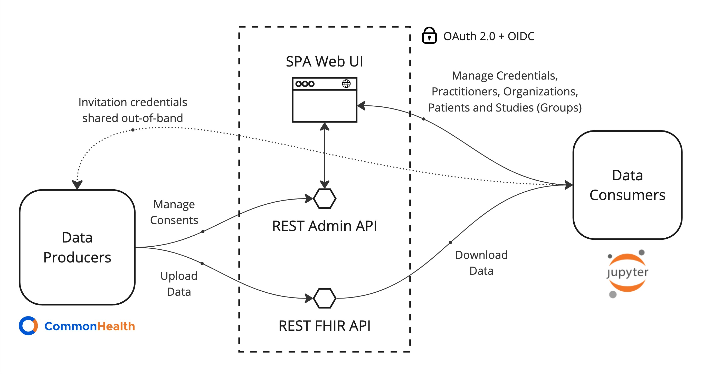
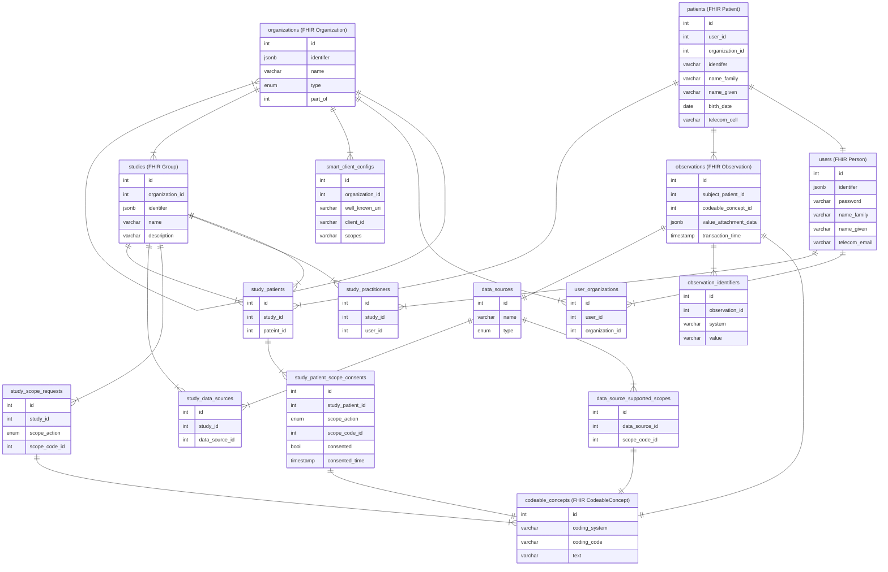

# JupyterHealth Exchange
JupyterHealth Exchange is a Django web application that facilitates the sharing of user-consented medical data with authorized consumers through a web UI, REST and FHIR APIs.

In the context of JupyterHealth, data producers are typically study participants (FHIR *Patients*) using the [CommonHealth Android App](https://play.google.com/store/apps/details?id=org.thecommonsproject.android.phr) linked to personal devices (eg Glucose Monitors) and data consumers are typically researchers (FHIR *Practitioners*).



Features include:

- OAuth 2.0, OIDC and SMART on FHIR Identity Provision using [django-oauth-toolkit](https://github.com/jazzband/django-oauth-toolkit)
- FHIR R5 schema validation using [fhir.resources](https://github.com/glichtner/fhir.resources) 
- REST APIs using [Django Rest Framework](https://github.com/encode/django-rest-framework)
- Built-in, light-weight Vanilla JS SPA UI (npm not required) using [oidc-clinet-ts](https://github.com/authts/oidc-client-ts), [handlebars](https://github.com/handlebars-lang/handlebars.js) and [bootstrap](https://github.com/twbs/bootstrap)

## Limitations & Status

This project is currently in a Proof of Concept stage, the project can be viewed on GitHub at the following URL:

https://github.com/orgs/the-commons-project/projects/8

## Getting Started

1. Set up your Python environment - this project uses Django **version 5.1** which requires python  **3.10, 3.11, 3.12 or 3.13**
1. Create a new Postgres DB (currently only Postgres is supported because of json functions)
1. Seed the DB by running the SQL commands found in `db/seed.sql`
1. Make a copy of `env_example.txt`, update the `DB_*` properties to match the new DB and save it as `.env`
1. Ensure the `.env` is loaded into your Python environment, eg for pipenv run `$ pipenv shell`
1. Start the server with `$ python manage.py runserver`
1. Browse to http://localhost:8000/admin and enter the credentials `super@example.com` `Jhe1234!`
1. Browse to *Applications* under *Django OAuth Toolkit* and create a new application
   - Leave *User* empty
   - Set *Redirect URLs* to include `http://localhost:8000/auth/callback` and any other hosts
   - Set *Type* to Public
   - Set *Authorization Grant Type* to Authorization code
   - Leave *Secret* blank
   - *Name* the app whatever you like
   - Check *Skip authorization*
   - Set *Algorithm* to RSA with SHA-2 256
   - Skip Allowed origins for now10.
1. Return to the `.env` file and update `OIDC_CLIENT_ID` with the newly created app Client ID and restart the python environment and Django server
1. Browse to http://localhost:8000/ and log in with the credentials `anna@example.com` `Jhe1234!`and you should be directed to the `/portal/organizations` path with some example Organizations is the dropdown

## Working with the Web UI

### Patients & Practitioners 

- Any user accessing the Web UI is a data consumer and considered a [Practitioner](https://build.fhir.org/practitioner.html)
- Any user uploading data is considered a [Patient](https://build.fhir.org/patient.html)
- The same OAuth2.0 strategy is used for both Practitioners and Patients, the only difference being that the credentials are provided out-of-band for Patients

### Organizations

- An [Organization](https://build.fhir.org/organization.html) is a group of Practitioners
- An Organization is typically hierarchical with sub-Organizations eg Institution, Department, Lab etc
- A Patient belongs to a single Organization (TBD: belong to multiple)
- A Practitioner belongs to at least one Organization

### Studies

- A Study is a [Group](https://build.fhir.org/group.html) of Patients and belongs to a single Organization
- A Study has one or more Data Sources and one or more Scope Requests
- When a Patient is added to a Study, they must explicitly consent to sharing the requested Scopes before any data (Observations) can be uploaded or shared

### Observations

- An [Observation](https://www.hl7.org/fhir/observation.html) is Patient data and belongs to a single Patient
- An Observation must reference a Patient ID as the *subject* and a Data Source ID as the *device*
- Personal device data is expected to be in the [Open mHealth](https://www.openmhealth.org/documentation/#/overview/get-started) (JSON) format however the system can be easily extended to support any binary data attachments or discrete Observation records
- Observation data is stored as a *valueAttachment* in Base 64 encoded JSON binary
- Authorization to view Observations depends on the relationship of Organization, Study and Consents as described above

### Data Sources

- A Data Source is anything that produces Observations (typically a device app eg iHealth)
- A Data Source supports one or more Scopes (types) of Observations (eg Blood Glucose)
- An Observation references a Data Source ID in the *device* field

## Working with APIs

### Auth API

- The OAuth 2.0 Authorization Code grant flow with PKCE is used to issue Access, Refresh and ID tokens
- Endpoints and configuration details can be discovered from the OIDC metadata endpoint:
	`/o/.well-known/openid-configuration`
- Note: make sure to set the `Content-Type: "application/x-www-form-urlencoded"` HTTP header
- The returned Access Token should be included in the `Authorization` header for all API requests with the prefix `Bearer `

### Admin REST API

- The Admin API is used by the Web UI SPA for Practitioner/Patient/Organization/Study management and Patient data provider apps/clients to manage Patient consents.

#### Profile

- The `profile` endpoint returns the current user details.

```json
// GET https://jhe.fly.dev/api/v1/users/profile
{
    "id": 10001,
    "email": "peter@example.com",
    "firstName": "Peter",
    "lastName": "ThePatient",
    "patient": {
        "id": 40001,
      	...
    }
}
```

#### Patient Consents

- The `consents` endpoint returns the studies that are pending and consented for the specified Patient. In this example, the Patient has been invited to *Demo Study 2* and has already consented to sharing blood glucose data with *Demo Study 1*.

```json
// GET /api/v1/patients/40001/consents
{
    "patient": {
        "id": 40001,
				//...
    },
    "consolidatedConsentedScopes": [
        {
            "id": 50002,
            "codingSystem": "https://w3id.org/openmhealth",
            "codingCode": "omh:blood-pressure:4.0",
            "text": "Blood pressure"
        }
    ],
    "studiesPendingConsent": [
        {
            "id": 30002,
            "name": "Demo Study 2",
            "organization": { ... }
            "dataSources": [ ... ],
            "pendingScopeConsents": [
                {
                    "code": {
                        "id": 50002,
                        "codingSystem": "https://w3id.org/openmhealth",
          							"codingCode": "omh:blood-pressure:4.0",
                        "text": "Blood pressure"
                    },
                    "consented": null
                }
            ]
        }
    ],
    "studies": [
        {
            "id": 30001,
            "name": "Demo Study 1",
            "organization": { ... },
            "dataSources": [ ... ],
            "scopeConsents": [
                {
                    "code": {
                        "id": 50001,
                        "codingSystem": "https://w3id.org/openmhealth",
                        "codingCode": "omh:blood-glucose:4.0",
                        "text": "Blood glucose"
                    },
                    "consented": true
                }
            ]
        }
    ]
}
```

- To respond to requested consents, a POST is sent to the same `consents` endpoint with the scope and the `consented` boolean.

```json
// POST /api/v1/patients/40001/consents
{
  "studyScopeConsents": [
    {
      "studyId": 30002,
      "scopeConsents": [
        {
            "codingSystem": "https://w3id.org/openmhealth",
            "codingCode": "omh:blood-pressure:4.0",
            "consented": true
        }
      ]
    }
  ]
}
  
```

- A `PATCH` request can be sent with the same payload to update an existing Consent
- A `DELETE` request can be sen with the same payload excluding `scopeConsents.consented` to delete the Consent

### FHIR REST API

#### Patients

- The `FHIR Patient` endpoint returns a list of Patients as a FHIR Bundle for a given Study ID passed as query string parameter`_has:Group:member:_id`

```json
// GET /fhir/r5/Patient?_has:Group:member:_id=30001
{
    "resourceType": "Bundle",
    "type": "searchset",
    "entry": [
        {
            "resource": {
                "resourceType": "Patient",
                "id": "40001",
                "meta": {
                    "lastUpdated": "2024-10-23T12:35:25.142027+00:00"
                },
                "identifier": [
                    {
                        "value": "fhir-1234",
                        "system": "http://ehr.example.com"
                    }
                ],
                "name": [
                    {
                        "given": [
                            "Peter"
                        ],
                        "family": "ThePatient"
                    }
                ],
                "birthDate": "1980-01-01",
                "telecom": [
                    {
                        "value": "peter@example.com",
                        "system": "email"
                    },
                    {
                        "value": "347-111-1111",
                        "system": "phone"
                    }
                ]
            }
        },
        ...
```

#### Observations

- The `FHIR Observation` endpoint returns a list of Observations as a FHIR Bundle
- At least one of Study ID, passed as `patient._has:Group:member:_id` or Patient ID, passed as `patient` query parameters are required
- `subject.reference` references a Patient ID
- `device.reference` references a Data Source ID
- `valueAttachment` is Base 64 Encoded Binary JSON

```json
// GET /fhir/r5/Observation?patient._has:Group:member:_id=30001&patient=40001&code=https://w3id.org/openmhealth|omh:blood-pressure:4.0
{
    "resourceType": "Bundle",
    "type": "searchset",
    "entry": [
        {
            "resource": {
                "resourceType": "Observation",
                "id": "63416",
                "meta": {
                    "lastUpdated": "2024-10-25T21:14:02.871132+00:00"
                },
                "identifier": [
                    {
                        "value": "6e3db887-4a20-3222-9998-2972af6fb091",
                        "system": "https://ehr.example.com"
                    }
                ],
                "status": "final",
                "subject": {
                    "reference": "Patient/40001"
                },
                "device": {
                  "reference": "Device/70001"
                },
                "code": {
                    "coding": [
                        {
                            "code": "omh:blood-pressure:4.0",
                            "system": "https://w3id.org/openmhealth"
                        }
                    ]
                },
                "valueAttachment": {
                    "data": "eyJib2R5IjogeyJlZmZlY3RpdmVfdGltZV9mcmFtZSI6IHsiZGF0ZV90aW1lIjogIjIwMjQtMDUt\nMDJUMDc6MjE6MDAtMDc6MDAifSwgInN5c3RvbGljX2Jsb29kX3ByZXNzdXJlIjogeyJ1bml0Ijog\nIm1tSGciLCAidmFsdWUiOiAxMjJ9LCAiZGlhc3RvbGljX2Jsb29kX3ByZXNzdXJlIjogeyJ1bml0\nIjogIm1tSGciLCAidmFsdWUiOiA3N319LCAiaGVhZGVyIjogeyJ1dWlkIjogIjZlM2RiODg3LTRh\nMjAtMzIyMi05OTk4LTI5NzJhZjZmYjA5MSIsICJtb2RhbGl0eSI6ICJzZW5zZWQiLCAic2NoZW1h\nX2lkIjogeyJuYW1lIjogImJsb29kLXByZXNzdXJlIiwgInZlcnNpb24iOiAiMy4xIiwgIm5hbWVz\ncGFjZSI6ICJvbWgifSwgImNyZWF0aW9uX2RhdGVfdGltZSI6ICIyMDI0LTEwLTI1VDIxOjEzOjMx\nLjQzOFoiLCAiZXh0ZXJuYWxfZGF0YXNoZWV0cyI6IFt7ImRhdGFzaGVldF90eXBlIjogIm1hbnVm\nYWN0dXJlciIsICJkYXRhc2hlZXRfcmVmZXJlbmNlIjogImh0dHBzOi8vaWhlYWx0aGxhYnMuY29t\nL3Byb2R1Y3RzIn1dLCAic291cmNlX2RhdGFfcG9pbnRfaWQiOiAiZTZjMTliMDQyOGM4NWJiYjdj\nMTk4MGNiOTRkZDE3N2YiLCAic291cmNlX2NyZWF0aW9uX2RhdGVfdGltZSI6ICIyMDI0LTA1LTAy\nVDA3OjIxOjAwLTA3OjAwIn19",
                    "contentType": "application/json"
                }
            }
        },
        ...
```

- Observations are uploaded as FHIR Batch bundles sent as a POST to the root endpoint

```json
// POST /fhir/r5/
{
  "resourceType": "Bundle",
  "type": "batch",
  "entry": [
    {
      "resource": {
        "resourceType": "Observation",
        "status": "final",
        "code": {
          "coding": [
            {
              "system": "https://w3id.org/openmhealth",
              "code": "omh:blood-pressure:4.0"
            }
          ]
        },
        "subject": {
          "reference": "Patient/40001"
        },
        "device": {
          "reference": "Device/70001"
        },
        "identifier": [
            {
                "value": "6e3db887-4a20-3222-9998-2972af6fb091",
                "system": "https://ehr.example.com"
            }
        ],
        "valueAttachment": {
          "contentType": "application/json",
          "data": "eyJzeXN0b2xpY19ibG9vZF9wcmVzc3VyZSI6eyJ2YWx1ZSI6MTQyLCJ1bml0IjoibW1IZyJ9LCJkaWFzdG9saWNfYmxvb2RfcHJlc3N1cmUiOnsidmFsdWUiOjg5LCJ1bml0IjoibW1IZyJ9LCJlZmZlY3RpdmVfdGltZV9mcmFtZSI6eyJkYXRlX3RpbWUiOiIyMDIxLTAzLTE0VDA5OjI1OjAwLTA3OjAwIn19"
        }
      },
      "request": {
        "method": "POST",
        "url": "Observation"
      }
    },
    ...
```

## Architecture

### Django

Django is a mature and well-supported web framework but was specifically chosen due to resourcing requirements. There are a few accommodations that had to be made for Django to support FHIR as described below.

#### camelCase

- FHIR uses camelCase whereas Django uses snake_case.
- The [djangorestframework-camel-case](https://github.com/vbabiy/djangorestframework-camel-case) library is used to support camelCase but the conversion happens downstream whereas the schema validation happens upstream, so manually calling `humps` is also required in parts.

#### DRF Serializers and Pydantic

- The Django Rest Framework uses the concept of Serializers to validate schemas, whereas the FHIR validator uses Pydantic.
- It is not reasonable to re-write the entire validation in the Serializer, so instead a combination of the two are used:
  - Top-level fields (most importantly the `id` of a record) are managed by the Serializer.
  - Nested fields (for example `code{}.coding[].system` above) are configured as a JSON field in the Serializer (so the top level field is this example is `code`) and then Pydantic is used to validate the whole schema including nested JSON.

- There is a [library](https://github.com/georgebv/drf-pydantic) that may allow Pydantic to be used as a Serializer but this needs to be explored further 

#### JSON Responses

- Postgres has rich JSON support allowing responses to be built directly from a raw Django SQL queries rather than using another layer of transforming logic.

### Single Page App (SPA) Web UI

A hard requirement was to avoid additional servers and frameworks (eg npm, react, etc) for the front end Web UI. Django supports traditional server-side templating but a modern Single Page App is better suited to this use case of interacting with the Admin REST API. For these reasons, a simple Vanilla JS SPA has been developed using [handlebars](https://github.com/handlebars-lang/handlebars.js) to render client side views from static HTML served using Django templates. The only other additional dependencies are [oidc-clinet-ts](https://github.com/authts/oidc-client-ts) for auth and [bootstrap](https://github.com/twbs/bootstrap) for styling.

### Data Model - To be Updated



## Deployment

For deployment options and a comprehensive guide take a look at the official [Django Deployment docs](https://docs.djangoproject.com/en/5.1/howto/deployment/)

### Deploying with the included Dockerfile

An example Dockerfile is included to deploy the app using [gunicorn](https://gunicorn.org/) and [WhiteNoise](https://whitenoise.readthedocs.io/en/stable/django.html) for static files.

1. Create a new empty Postgres database (>= v16 recommended)
1. Edit `jhe/.env` and update the DB config and the `SITE_URL`  (use `jhe/env_example.txt` as template)
1. Migrate the DB by running `python manage.py migrate`
1. Seed the database by running the SQL commands found in `db/seed.sql`
1. From the `jhe` directory, build the image `$ docker build .`
1. Run the image `$ docker run -p 8000:8000 <image_id>`
