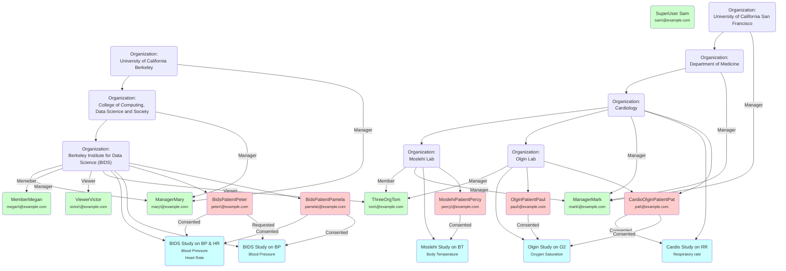

# JupyterHealth Exchange
JupyterHealth Exchange is a Django web application that facilitates the sharing of user-consented medical data with authorized consumers through a web UI, REST and FHIR APIs.

In the context of JupyterHealth, data producers are typically study participants (FHIR *Patients*) using the [CommonHealth Android App](https://play.google.com/store/apps/details?id=org.thecommonsproject.android.phr) linked to personal devices (eg Glucose Monitors) and data consumers are typically researchers (FHIR *Practitioners*).


Features include:

- OAuth 2.0, OIDC and SMART on FHIR Identity Provision using [django-oauth-toolkit](https://github.com/jazzband/django-oauth-toolkit)
- FHIR R5 schema validation using [fhir.resources](https://github.com/glichtner/fhir.resources)
- REST APIs using [Django Rest Framework](https://github.com/encode/django-rest-framework)
- Built-in, light-weight Vanilla JS SPA UI (npm not required) using [oidc-clinet-ts](https://github.com/authts/oidc-client-ts), [handlebars](https://github.com/handlebars-lang/handlebars.js) and [bootstrap](https://github.com/twbs/bootstrap)

## Limitations & Status

This project is currently in a Proof of Concept stage, the project can be viewed on GitHub at the following URL:

https://github.com/orgs/the-commons-project/projects/8

## Getting Started

> [!TIP]
> **If you are a user (Practitioner or Patient), please take note of the following access information for the [JupyterHealth Website](https://jhe.fly.dev):**
> - JHE Default Invite Code is ```helloworld``` (see [here](https://github.com/the-commons-project/jupyterhealth-exchange/blob/main/jhe/dot_env_example.txt#L3))
> - JHE Default Super User ```sam@example.com/Jhe1234!``` can create and edit top level organizations. Any user can create sub-organizations.

> [!TIP]
>**Quick start:** For local development, Skip the steps 8–12 as the `seed_db` command will register the Django OAuth2 application. Also, Pre‑generated values of  `OIDC_RSA_PRIVATE_KEY`, `PATIENT_AUTHORIZATION_CODE_CHALLENGE`, and `PATIENT_AUTHORIZATION_CODE_VERIFIER` are provided in `dot_env_example.txt` for dev/demo use only.

> [!NOTE]
> Due to browser security restrictions and the [oidc-client-ts](https://github.com/authts/oidc-client-ts) used for authentication, the web app **must be accessed over HTTPS for any hostname other than localhost** - see [Running in Production](#running-in-production) below.


1. Set up your Python environment and install dependencies from `jhe/Pipfile` - this project uses Django **version 5.2** which requires python  **3.10, 3.11, 3.12 or 3.13**

    - NB: If using pipenv it is recommended to run `pipenv sync` against the lock file to match package versions
1. Create a new Postgres DB (currently only Postgres is supported because of json functions)
1. Copy `jhe/dot_env_example.txt` to `jhe/.env` and update the `DB_*` parameters to match (2)
1. Ensure the `.env` is loaded into your Python environment, eg for pipenv run `$ pipenv shell`
1. Run the Django migration `$ python manage.py migrate` to create the database tables.
1. Seed the database by running the Django management command `$ python manage.py seed`
1. Start the server with `$ python manage.py runserver`

     ***Skip steps 8-12 below if doing Quick start above***
1. Browse to http://localhost:8000/admin and enter the credentials `sam@example.com` `Jhe1234!`
1. Browse to *Applications* under *Django OAuth Toolkit* and create a new application
   - Leave *User* empty
   - Set *Redirect URLs* to include `http://localhost:8000/auth/callback` and any other hosts
   - Set *Type* to Public
   - Set *Authorization Grant Type* to Authorization code
   - Leave *Secret* blank
   - *Name* the app whatever you like
   - Check *Skip authorization*
   - Set *Algorithm* to RSA with SHA-2 256
   - Skip Allowed origins
   - Save and then Log Out of Django Admin
1. Create an RS256 Private Key (step by step [here](https://django-oauth-toolkit.readthedocs.io/en/latest/oidc.html#creating-rsa-private-key))
1. Create a new static PKCE verifier - a random alphanumeric string 44 chars long, and then create the challenge [here](https://tonyxu-io.github.io/pkce-generator).
1. Return to the `.env` file
   - Update `OIDC_CLIENT_ID` with the newly created app Client ID
   - Update the `OIDC_RSA_PRIVATE_KEY` with the newly created Private Key
   - Update `PATIENT_AUTHORIZATION_CODE_CHALLENGE` and `PATIENT_AUTHORIZATION_CODE_VERIFIER` with PKCE static values generated above
   - Restart the python environment and Django server
1. Browse to http://localhost:8000/ and log in with the credentials `mary@example.com` `Jhe1234!` and you should be directed to the `/portal/organizations` path with some example Organizations is the dropdown
1. Before the each commit always make sure to execute `pre-commit run --all-files` to make sure the PEP8 standards.
1. Git hook for the pre-commit can also be installed `pre-commit install` to automate the process.
1. If a hook fails, fix the issues, stage the changes, and commit again — the commit only succeeds when hooks pass.
> [!WARNING]
> The `OIDC_RSA_PRIVATE_KEY`, `PATIENT_AUTHORIZATION_CODE_CHALLENGE`, and `PATIENT_AUTHORIZATION_CODE_VERIFIER` provided in `dot_env_example.txt` are public demo keys for development only and must not be used in production.

## Troubleshooting Local Development

**Issue:** On Windows machines, users may experience a blank screen after logging in, caused by incorrect OIDC configuration.
**Solution:** Explicitly set OIDC variables in your `settings.py`. For further details see [Troubleshooting Local Development](doc/troubleshooting-local-dev.md).

By setting these variables explicitly, you prevent incorrect path injections and ensure proper URL formation, resolving the blank screen issue after login on Windows machines.

## Working with the Web UI

### Patients & Practitioners

- Any user accessing the Web UI is a [Practitioner](https://build.fhir.org/practitioner.html) (data consumer) by default
- [Patient](https://build.fhir.org/patient.html) users (data producers) are registered by Practitioners and sent a link to authenticate and upload data
- The same OAuth 2.0 strategy is used for both Practitioners and Patients, the only difference being that the authorization code is provided out-of-band for Patients (invitation link)

### Organizations

- An [Organization](https://build.fhir.org/organization.html) is a group of Practitioners, Patients and Studies
- An Organization is typically hierarchical with sub-Organizations eg Institution, Department, Lab etc
- A Practitioner belongs to one or more Organization
- A Patient belongs to one or more Organization
- A Study belongs to one single Organization

### Studies

- A Study is a [Group](https://build.fhir.org/group.html) of Patients and belongs to a single Organization
- A Study has one or more Data Sources and one or more Scope Requests
- When a Patient is added to a Study, they must explicitly consent to sharing the requested Scopes before any data (Observations) can be uploaded or shared

### Observations

- An [Observation](https://www.hl7.org/fhir/observation.html) is Patient data and belongs to a single Patient
- An Observation must reference a Patient ID as the *subject* and a Data Source ID as the *device*
- Personal device data is expected to be in the [Open mHealth](https://www.openmhealth.org/documentation/#/overview/get-started) (JSON) format however the system can be easily extended to support any binary data attachments or discrete Observation records
- Observation data is stored as a *valueAttachment* in Base 64 encoded JSON binary
- Authorization to view Observations depends on the relationship of Organization, Study and Consents as described above

### Data Sources

- A Data Source is anything that produces Observations (typically a device app eg iHealth)
- A Data Source supports one or more Scopes (types) of Observations (eg Blood Glucose)
- An Observation references a Data Source ID in the *device* field

### Use Case Example

1. Sign up as a new user from the Web UI
2. Create a new Organization (your user is automatically added to the Organization with a Manager role)
3. Create a new Study for the Organization (View Organization > Studies+)
4. Create a new Patient for the Organization using a different email than (1) (Patients > Add Patient)
5. Add Data Sources and Scopes to the Study (View Study > Data Sources+, Scope Requests+)
6. Add the Patient to the Study (Patients > check box > Add Patient(s) to Study)
7. Create an Invitation Link for the Patient (View Patient > Generate Invitation Link)
8. Use the code in the invitation link with the Auth API to swap it for an access token
9. Upload Observations using the FHIR API and access token
10. View the Observations from the web UI

## Roles Based Access Control

Whether or not a Practitioner user can view particular Patients, Studies and Observations depends on membership of the Organization that the Patients/Studies/Observations belong to.

Whether or not a Practitioner user can edit the Data Sources, Organization, Organization's Patients or Studies depends on the role they are assigned to for that Organization at the time of being added. When a user create a new Organization they are automatically added as a  Manager of the Organization. Permissions for roles are outlined in the table below.

| Permission        | Super User | Manager | Member | Viewer |
| ----------------- | ---------- | ------- | ------ | ------ |
| Edit Data Sources | [x]        | [ ]     | [ ]    | [ ]    |
| Edit Organization | [x]        | [x]     | [ ]    | [ ]    |
| Edit Patients     | [x]        | [x]     | [x]    | [ ]    |
| Edit Studies      | [x]        | [x]     | [x]    | [ ]    |
| View All          | [x]        | [x]     | [x]    | [x]    |

## Open mHealth Schemas

If Observations are sent with data attached in the Open mHealth format (eg `Observation.code=omh:blood-glucose:4.0`) JSON Schema validation is used to check the payload. Example values can be found at `data/omh/examples/data-points` and the JSON schemas can be found at `data/omh/json-schemas`. See [Open mHealth](https://www.openmhealth.org/) for more information.

## Test Data

### Database Seed

- The initial Database is seeded with a minimal set of records to provide an example of the different entity relationships, see the diagram below.



### Iglu Test Data

- Additional test data from the [iglu project](https://github.com/irinagain/iglu) can be seeded by running the following command (please note this can take 10-20 minutes to run)
  `$ python manage.py iglu`
- This creates a new study under the "Berkeley Institute for Data Science (BIDS)" Organization with 19 mock patients and 1745 real Observation data points


## Working with APIs

### Auth API

- The OAuth 2.0 Authorization Code grant flow with PKCE is used to issue Access, Refresh and ID tokens for both Practitioners (web login) and Patients (secret invitation link)
- The Patient authorization code is generated by the server and then shared with the user out-of-band as a secret invitation link
- OAuth is configured from the Django Admin page (See Getting Started above)
- Endpoints and configuration details can be discovered from the OIDC metadata endpoint:
	`/o/.well-known/openid-configuration`
- The returned Access Token should be included in the `Authorization` header for all API requests with the prefix `Bearer `
- Because the Patient authorization code is generated by the server, the PKCE code challenge and code verifier for Patient auth must be static values and set by the env vars (example below). The Patient client then sends this `code_verifier` along with the authorization code to obtain tokens. The `redirect_uri` serves no purpose (as the initial authorization code has already been issued) but is required per OAuth spec.
```
PATIENT_AUTHORIZATION_CODE_CHALLENGE = '-2FUJ5UCa7NK9hZWS0bc0W9uJ-Zr_-Pngd4on69oxpU'
PATIENT_AUTHORIZATION_CODE_VERIFIER  = 'f28984eaebcf41d881223399fc8eab27eaa374a9a8134eb3a900a3b7c0e6feab5b427479f3284ebe9c15b698849b0de2'

Client POST
Content-Type: application/x-www-form-urlencoded
code=4AWKhgaaomTSf9PfwxN4ExnXjdSEqh&grant_type=authorization_code&redirect_uri=https%3A%2F%2Fexample.com%2Fauth%2Fcallback
&client_id=XXXXXXXXXXXXXXXXXXXXXXXXXXXXXXXXXXXXXXXX
&code_verifier=f28984eaebcf41d881223399fc8eab27eaa374a9a8134eb3a900a3b7c0e6feab5b427479f3284ebe9c15b698849b0de2
```
> [!NOTE]
> It is understood using static values for PKCE runs against best practises however this is only used for the Patient client auth and not the Practitioner Web UI or API auth. The Patient client authorization code is generated by the server and shared out of band and therefore dynamic PKCE can not be used unless it is passed along with the invitation secret link, which would defeat the purpose of an additional check.

#### Invitation Link Structure

An invitation link may look something like below

```
https://play.google.com/store/apps/details?id=org.thecommonsproject.android.phr.dev&referrer=cloud_sharing=jhe.fly.dev|LhS05iR1rOnpS4JWfP6GeVUIhaRcRh
```

- The purpose of the prefix URL (eg `https://play.google.com/store/apps/details?id=org.thecommonsproject.android.phr.dev&referrer=cloud_sharing=` ) is for the device to know which app to launch. In this case, the CommonHealth app is launched via Google Play so that if the user does not yet have the CommonHealth app installed they can install it within the flow
- The prefix URL component may be more simple, for example `https://carex.ai/?invitation=` to launch the CareX app
- The suffix of the link contains the hostname (optional) followed by a pipe character and the OAuth2 Authorization Code, for example `jhe.fly.dev|LhS05iR1rOnpS4JWfP6GeVUIhaRcRh`
- The purpose of the suffix is to provide the app with information on what host to talk to (as there may be many JHEs configured for the one Patient) as well as the Authorization Code that can be swapped for an Access Token to use the API (see above)
- The prefix URL is configured in the `.env` as `CH_INVITATION_LINK_PREFIX`
- The host name is included by default but can optionally be removed from the link (if there will only ever be one host for the app) by configuring the `.env` with `CH_INVITATION_LINK_EXCLUDE_HOST=True`
- So in the example of `https://carex.ai/?invitation=jhe.fly.dev|LhS05iR1rOnpS4JWfP6GeVUIhaRcRh`
  1. The CareX app is launched with the URL
  1. The CareX app parses the `invitation` parameter
  1. The CareX app gets the token endpoint from the invitation host `https://jhe.fly.dev/o/.well-known/openid-configuration`
  1. The CareX app posts `LhS05iR1rOnpS4JWfP6GeVUIhaRcRh` to get an access token
  1. The CareX app uses the API below to set consents
  1. The CareX app uses the API below to upload data

#### Single Sign-On (SSO) with SAML2

The [django-saml2-auth](https://github.com/grafana/django-saml2-auth) library is included to support SSO with SAML2.

##### Example SAML2 Flow with [mocksaml.com](mocksaml.com)

Modify the `.env` to match below

```env
# Default: SSO disabled. Change to 1 to enable.
SAML2_ENABLED=1

# Comma-separated list matches email domains permitted to sign in via SSO
SSO_VALID_DOMAINS=example.com,example.org

# MockSAML metadata URL (used to auto-configure IdP endpoints & certificate)
IDENTITY_PROVIDER_METADATA_URL=https://mocksaml.com/api/saml/metadata
```

###### Temporarily Switch on Debug for logging

Add the below to `./jhe/settings.py`


```python
# settings.py (demo only)
DEBUG = True
```
> [!WARNING]
> Use Debug for testing only, switch off Debug for Production.

###### Test Flow

1. Visit https://mocksaml.com/saml/login and enter the fields below:

   - ACS URL: `http://localhost:8000/sso/acs/` (or substitute your hostname) **End with a trailing slash**

   - Audience: `http://localhost:8000/sso/acs/`

2. Enter any email name `@example.com`
2. Enter any password
2. Click Sign in
2. The JHE portal should be displayed with the user in the matching user name in the bottom left hand corner

###### Notes

- The JHE app reads IdP configuration from `IDENTITY_PROVIDER_METADATA_URL`
- Only users with email addresses on the `SSO_VALID_DOMAINS` are permitted


### Admin REST API

- The Admin API is used by the Web UI SPA for Practitioner/Patient/Organization/Study management and Patient data provider apps/clients to manage Patient consents.

#### Profile

- The `profile` endpoint returns the current user details.

```json
// GET /api/v1/users/profile
{
    "id": 10001,
    "email": "peter@example.com",
    "firstName": "Peter",
    "lastName": "ThePatient",
    "patient": {
        "id": 40001,
      	...
    }
}
```

#### Patient Consents

- The `consents` endpoint returns the studies that are pending and consented for the specified Patient. In this example, the Patient has been invited to *Demo Study 2* and has already consented to sharing blood glucose data with *Demo Study 1*.

```json
// GET /api/v1/patients/40001/consents
{
    "patient": {
        "id": 40001,
				//...
    },
    "consolidatedConsentedScopes": [
        {
            "id": 50002,
            "codingSystem": "https://w3id.org/openmhealth",
            "codingCode": "omh:blood-pressure:4.0",
            "text": "Blood pressure"
        }
    ],
    "studiesPendingConsent": [
        {
            "id": 30002,
            "name": "Demo Study 2",
            "organization": { ... }
            "dataSources": [ ... ],
            "pendingScopeConsents": [
                {
                    "code": {
                        "id": 50002,
                        "codingSystem": "https://w3id.org/openmhealth",
          							"codingCode": "omh:blood-pressure:4.0",
                        "text": "Blood pressure"
                    },
                    "consented": null
                }
            ]
        }
    ],
    "studies": [
        {
            "id": 30001,
            "name": "Demo Study 1",
            "organization": { ... },
            "dataSources": [ ... ],
            "scopeConsents": [
                {
                    "code": {
                        "id": 50001,
                        "codingSystem": "https://w3id.org/openmhealth",
                        "codingCode": "omh:blood-glucose:4.0",
                        "text": "Blood glucose"
                    },
                    "consented": true
                }
            ]
        }
    ]
}
```

- To respond to requested consents, a POST is sent to the same `consents` endpoint with the scope and the `consented` boolean.

```json
// POST /api/v1/patients/40001/consents
{
  "studyScopeConsents": [
    {
      "studyId": 30002,
      "scopeConsents": [
        {
            "codingSystem": "https://w3id.org/openmhealth",
            "codingCode": "omh:blood-pressure:4.0",
            "consented": true
        }
      ]
    }
  ]
}

```

- A `PATCH` request can be sent with the same payload to update an existing Consent
- A `DELETE` request can be sen with the same payload excluding `scopeConsents.consented` to delete the Consent

### FHIR REST API

#### Patients

- The `FHIR Patient` endpoint returns a list of Patients as a FHIR Bundle for a given Study ID passed as query parameter`_has:Group:member:_id` or alternatively a single Patient matching the query parameter `identifier=<system>|<value>`

| Query Parameter         | Example                         | Description                                                  |
| ----------------------- | ------------------------------- | ------------------------------------------------------------ |
| `_has:Group:member:_id` | `30001`                         | Filter by Patients that are in the Study with ID 30001       |
| `identifier`            | `http://ehr.example.com|abc123` | Filter by single Patient with Identifier System `http://ehr.example.com` and Value `abc123` |

```json
// GET /fhir/r5/Patient?_has:Group:member:_id=30001
{
    "resourceType": "Bundle",
    "type": "searchset",
    "entry": [
        {
            "resource": {
                "resourceType": "Patient",
                "id": "40001",
                "meta": {
                    "lastUpdated": "2024-10-23T12:35:25.142027+00:00"
                },
                "identifier": [
                    {
                        "value": "fhir-1234",
                        "system": "http://ehr.example.com"
                    }
                ],
                "name": [
                    {
                        "given": [
                            "Peter"
                        ],
                        "family": "ThePatient"
                    }
                ],
                "birthDate": "1980-01-01",
                "telecom": [
                    {
                        "value": "peter@example.com",
                        "system": "email"
                    },
                    {
                        "value": "347-111-1111",
                        "system": "phone"
                    }
                ]
            }
        },
        ...
```

#### Observations

- The `FHIR Observation` endpoint returns a list of Observations as a FHIR Bundle
- At least one of Study ID, passed as `patient._has:Group:member:_id` or Patient ID, passed as `patient` or Patient Identifier passed as `patient.identifier=<system>|<value>` query parameters are required
- `subject.reference` references a Patient ID
- `device.reference` references a Data Source ID
- `valueAttachment` is Base 64 Encoded Binary JSON

| Query Parameter                 | Example                                               | Description                                                  |
| ------------------------------- | ----------------------------------------------------- | ------------------------------------------------------------ |
| `patient._has:Group:member:_id` | `30001`                                               | Filter by Patients that are in the Study with ID 30001       |
| `patient`                       | `40001`                                               | Filter by single Patient with ID 40001                       |
| `patient.identifier`            | `http://ehr.example.com|abc123`                       | Filter by single Patient with Identifier System `http://ehr.example.com` and Value `abc123` |
| `code`                          | `https://w3id.org/openmhealth|omh:blood-pressure:4.0` | Filter by Type/Scope with System `https://w3id.org/openmhealth` and Code `omh:blood-pressure:4.0` |


```json
// GET /fhir/r5/Observation?patient._has:Group:member:_id=30001&patient=40001&code=https://w3id.org/openmhealth|omh:blood-pressure:4.0
{
    "resourceType": "Bundle",
    "type": "searchset",
    "entry": [
        {
            "resource": {
                "resourceType": "Observation",
                "id": "63416",
                "meta": {
                    "lastUpdated": "2024-10-25T21:14:02.871132+00:00"
                },
                "identifier": [
                    {
                        "value": "6e3db887-4a20-3222-9998-2972af6fb091",
                        "system": "https://ehr.example.com"
                    }
                ],
                "status": "final",
                "subject": {
                    "reference": "Patient/40001"
                },
                "device": {
                  "reference": "Device/70001"
                },
                "code": {
                    "coding": [
                        {
                            "code": "omh:blood-pressure:4.0",
                            "system": "https://w3id.org/openmhealth"
                        }
                    ]
                },
                "valueAttachment": {
                    "data": "eyJib2R5IjogeyJlZmZlY3RpdmVfdGltZV9mcmFtZSI6IHsiZGF0ZV90aW1lIjogIjIwMjQtMDUt\nMDJUMDc6MjE6MDAtMDc6MDAifSwgInN5c3RvbGljX2Jsb29kX3ByZXNzdXJlIjogeyJ1bml0Ijog\nIm1tSGciLCAidmFsdWUiOiAxMjJ9LCAiZGlhc3RvbGljX2Jsb29kX3ByZXNzdXJlIjogeyJ1bml0\nIjogIm1tSGciLCAidmFsdWUiOiA3N319LCAiaGVhZGVyIjogeyJ1dWlkIjogIjZlM2RiODg3LTRh\nMjAtMzIyMi05OTk4LTI5NzJhZjZmYjA5MSIsICJtb2RhbGl0eSI6ICJzZW5zZWQiLCAic2NoZW1h\nX2lkIjogeyJuYW1lIjogImJsb29kLXByZXNzdXJlIiwgInZlcnNpb24iOiAiMy4xIiwgIm5hbWVz\ncGFjZSI6ICJvbWgifSwgImNyZWF0aW9uX2RhdGVfdGltZSI6ICIyMDI0LTEwLTI1VDIxOjEzOjMx\nLjQzOFoiLCAiZXh0ZXJuYWxfZGF0YXNoZWV0cyI6IFt7ImRhdGFzaGVldF90eXBlIjogIm1hbnVm\nYWN0dXJlciIsICJkYXRhc2hlZXRfcmVmZXJlbmNlIjogImh0dHBzOi8vaWhlYWx0aGxhYnMuY29t\nL3Byb2R1Y3RzIn1dLCAic291cmNlX2RhdGFfcG9pbnRfaWQiOiAiZTZjMTliMDQyOGM4NWJiYjdj\nMTk4MGNiOTRkZDE3N2YiLCAic291cmNlX2NyZWF0aW9uX2RhdGVfdGltZSI6ICIyMDI0LTA1LTAy\nVDA3OjIxOjAwLTA3OjAwIn19",
                    "contentType": "application/json"
                }
            }
        },
        ...
```

- Observations are uploaded as FHIR Batch bundles sent as a POST to the root endpoint

```json
// POST /fhir/r5/
{
  "resourceType": "Bundle",
  "type": "batch",
  "entry": [
    {
      "resource": {
        "resourceType": "Observation",
        "status": "final",
        "code": {
          "coding": [
            {
              "system": "https://w3id.org/openmhealth",
              "code": "omh:blood-pressure:4.0"
            }
          ]
        },
        "subject": {
          "reference": "Patient/40001"
        },
        "device": {
          "reference": "Device/70001"
        },
        "identifier": [
            {
                "value": "6e3db887-4a20-3222-9998-2972af6fb091",
                "system": "https://ehr.example.com"
            }
        ],
        "valueAttachment": {
          "contentType": "application/json",
          "data": "eyJzeXN0b2xpY19ibG9vZF9wcmVzc3VyZSI6eyJ2YWx1ZSI6MTQyLCJ1bml0IjoibW1IZyJ9LCJkaWFzdG9saWNfYmxvb2RfcHJlc3N1cmUiOnsidmFsdWUiOjg5LCJ1bml0IjoibW1IZyJ9LCJlZmZlY3RpdmVfdGltZV9mcmFtZSI6eyJkYXRlX3RpbWUiOiIyMDIxLTAzLTE0VDA5OjI1OjAwLTA3OjAwIn19"
        }
      },
      "request": {
        "method": "POST",
        "url": "Observation"
      }
    },
    ...
```


### Practitioner script: uploads observations for patients where the practitioner has the appropriate access

## Usage

```bash
python script.py \
  [--email <practitioner_email>] \
  [--password <practitioner_password>] \
  [--org-id <organization_id>] \
  [--study-id <study_id>] \
  [--patient-email <patient_email>]
```

## Arguments & Defaults

* `--email` — Practitioner login email. **Default:** `obs-upload@example.com`
* `--password` — Practitioner password. **Default:** `Jhe1234!`
* `--org-id` — Target organization ID. **Default:** `20003`
* `--study-id` — Target study ID (must have iHealth data source + blood-glucose scope). **Default:** `30006`
* `--patient-email` — Patient email to lookup/create/enroll. **Default:** `obs-upload-pat1@example.com`

If you omit any flags, the default is used. You can pass only what you want to change.

## Examples

**Run with all defaults:**

```bash
python script.py
```

**Run with all arguments specified:**

```bash
python script.py \
  --email practitioner@example.com \
  --password "Sup3r$ecret!" \
  --org-id 42 \
  --study-id 99 \
  --patient-email patient2@example.com
```


## Running in Production

### Django Server

The Django development server should not be used for production - more information is available at the official [Django Deployment docs](https://docs.djangoproject.com/en/5.1/howto/deployment/). One option included with JHE is the [gunicorn](https://gunicorn.org/) server with [WhiteNoise](https://whitenoise.readthedocs.io/en/stable/django.html) for static files, which can be run with the commands below.

```bash
$ python manage.py collectstatic --no-input
$ gunicorn --bind :8000 --workers 2 jhe.wsgi
```

### HTTPS

Due to browser security restrictions and the [oidc-client-ts](https://github.com/authts/oidc-client-ts) used for authentication, the web app **must be accessed over HTTPS for any hostname other than localhost**. Below is an example of serving the app over HTTPS using an NGINX reverse proxy.

#####  Install nginx and certbot

```bash
$ sudo apt update
$ sudo apt install -y nginx certbot
```

#### For servers that are publicly reachable

##### 1. Configure nginx

```bash
$ DOMAIN=YOUR_DOMAIN
$ sudo mkdir -p /var/www/certbot

$ sudo tee /etc/nginx/sites-available/jhe.conf >/dev/null <<NGINX
upstream jhe_app { server 127.0.0.1:8000; keepalive 16; }

server {
  listen 80;
  server_name ${DOMAIN};

  # ACME HTTP-01
  location ^~ /.well-known/acme-challenge/ {
    root /var/www/certbot;
  }

  # everything else HTTPS
  location / { return 301 https://\$host\$request_uri; }
}

server {
  listen 443 ssl http2;
  server_name ${DOMAIN};

  # temp self-signed while we fetch LE cert (optional if you already have none)
  ssl_certificate     /etc/ssl/certs/ssl-cert-snakeoil.pem;
  ssl_certificate_key /etc/ssl/private/ssl-cert-snakeoil.key;

  client_max_body_size 25m;

  location / {
    proxy_pass http://jhe_app;
    proxy_http_version 1.1;
    proxy_set_header Host               \$host;
    proxy_set_header X-Real-IP          \$remote_addr;
    proxy_set_header X-Forwarded-For    \$proxy_add_x_forwarded_for;
    proxy_set_header X-Forwarded-Proto  https;
    proxy_read_timeout 300s;
    proxy_send_timeout 300s;
  }
}
NGINX

$ sudo ln -sf /etc/nginx/sites-available/jhe.conf /etc/nginx/sites-enabled/jhe.conf
$ sudo rm -f /etc/nginx/sites-enabled/default
$ sudo nginx -t && (sudo nginx -s reload || sudo nginx)
```

##### 2. Get the certificate

```bash
$ sudo certbot certonly --webroot -w /var/www/certbot -d "$DOMAIN" --agree-tos -m admin@"$DOMAIN" --no-eff-email
```

##### 3. Update NGINX config to point to the new certificate and reload

```bash
$ sudo sed -i "s#ssl-cert-snakeoil.pem#/etc/letsencrypt/live/$DOMAIN/fullchain.pem#g; s#ssl-cert-snakeoil.key#/etc/letsencrypt/live/$DOMAIN/privkey.pem#g" /etc/nginx/sites-available/jhe.conf
sudo nginx -t && sudo nginx -s reload
```

##### 4. Auto-renew (no systemd needed)

```bash
echo '0 3 * * * root certbot renew --quiet --post-hook "nginx -s reload"' | sudo tee /etc/cron.d/certbot_renew >/dev/null
```

#### For servers that are not publicly reachable (DNS-01)

##### 1. Get the certificate

```bash
$ DOMAIN=YOUR_DOMAIN

# issue with manual DNS challenge
$ sudo certbot certonly --manual --preferred-challenges dns -d "$DOMAIN" --agree-tos -m admin@"$DOMAIN" --no-eff-email
# follow prompts to add the _acme-challenge TXT record, wait for DNS to propagate, then continue
```

##### 2. Configure NGINX and reload

```bash
$ sudo tee /etc/nginx/sites-available/jhe.conf >/dev/null <<NGINX
upstream jhe_app { server 127.0.0.1:8000; keepalive 16; }

server {
  listen 80;
  server_name ${DOMAIN};
  return 301 https://\$host\$request_uri;
}

server {
  listen 443 ssl http2;
  server_name ${DOMAIN};

  ssl_certificate     /etc/letsencrypt/live/${DOMAIN}/fullchain.pem;
  ssl_certificate_key /etc/letsencrypt/live/${DOMAIN}/privkey.pem;

  client_max_body_size 25m;

  location / {
    proxy_pass http://jhe_app;
    proxy_http_version 1.1;
    proxy_set_header Host               \$host;
    proxy_set_header X-Real-IP          \$remote_addr;
    proxy_set_header X-Forwarded-For    \$proxy_add_x_forwarded_for;
    proxy_set_header X-Forwarded-Proto  https;
    proxy_read_timeout 300s;
    proxy_send_timeout 300s;
  }
}
NGINX

$ sudo ln -sf /etc/nginx/sites-available/jhe.conf /etc/nginx/sites-enabled/jhe.conf
$ sudo rm -f /etc/nginx/sites-enabled/default
$ sudo nginx -t && (sudo nginx -s reload || sudo nginx)
```

##### 3. Renewals

For hands-off renewals with DNS-01, use a Certbot DNS plugin for your provider (e.g., python3-certbot-dns-cloudflare, python3-certbot-dns-route53) and issue with that plugin once then renewals become automatic. An example for Cloudflare is below.
```bash
$ sudo apt install -y python3-certbot-dns-cloudflare
$ sudo tee /root/cf.ini >/dev/null <<EOF
dns_cloudflare_api_token = <TOKEN_WITH_DNS_EDIT>
EOF

$ sudo chmod 600 /root/cf.ini
$ sudo certbot certonly --dns-cloudflare --dns-cloudflare-credentials /root/cf.ini -d "$DOMAIN"
```


## Architecture

### Django

Django is a mature and well-supported web framework but was specifically chosen due to resourcing requirements. There are a few accommodations that had to be made for Django to support FHIR as described below.

#### camelCase

- FHIR uses camelCase whereas Django uses snake_case.
- The [djangorestframework-camel-case](https://github.com/vbabiy/djangorestframework-camel-case) library is used to support camelCase but the conversion happens downstream whereas the schema validation happens upstream, so manually calling `humps` is also required in parts.

#### DRF Serializers and Pydantic

- The Django Rest Framework uses the concept of Serializers to validate schemas, whereas the FHIR validator uses Pydantic.
- It is not reasonable to re-write the entire validation in the Serializer, so instead a combination of the two are used:
  - Top-level fields (most importantly the `id` of a record) are managed by the Serializer.
  - Nested fields (for example `code{}.coding[].system` above) are configured as a JSON field in the Serializer (so the top level field is this example is `code`) and then Pydantic is used to validate the whole schema including nested JSON.

- There is a [library](https://github.com/georgebv/drf-pydantic) that may allow Pydantic to be used as a Serializer but this needs to be explored further

#### JSON Responses

- Postgres has rich JSON support allowing responses to be built directly from a raw Django SQL queries rather than using another layer of transforming logic.

### Single Page App (SPA) Web UI

A hard requirement was to avoid additional servers and frameworks (eg npm, react, etc) for the front end Web UI. Django supports traditional server-side templating but a modern Single Page App is better suited to this use case of interacting with the Admin REST API. For these reasons, a simple Vanilla JS SPA has been developed using [handlebars](https://github.com/handlebars-lang/handlebars.js) to render client side views from static HTML served using Django templates. The only other additional dependencies are [oidc-clinet-ts](https://github.com/authts/oidc-client-ts) for auth and [bootstrap](https://github.com/twbs/bootstrap) for styling.

### Data Model - To be Updated


## Deployment

For deployment options and a comprehensive guide take a look at the official [Django Deployment docs](https://docs.djangoproject.com/en/5.1/howto/deployment/)

### Deploying with the included Dockerfile

An example Dockerfile is included to deploy the app using [gunicorn](https://gunicorn.org/) and [WhiteNoise](https://whitenoise.readthedocs.io/en/stable/django.html) for static files.

1. Create a new empty Postgres database
1. Copy `jhe/dot_env_example.txt` to `jhe/.env` and update the `DB_*` parameters from (1)
1. Migrate the DB by running `python manage.py migrate`
1. Seed the database by running the Django management command `python manage.py seed_db`
1. From the `jhe` directory, build the image `$ docker build .`
1. Run the image `$ docker run -p 8000:8000 <image_id>`
