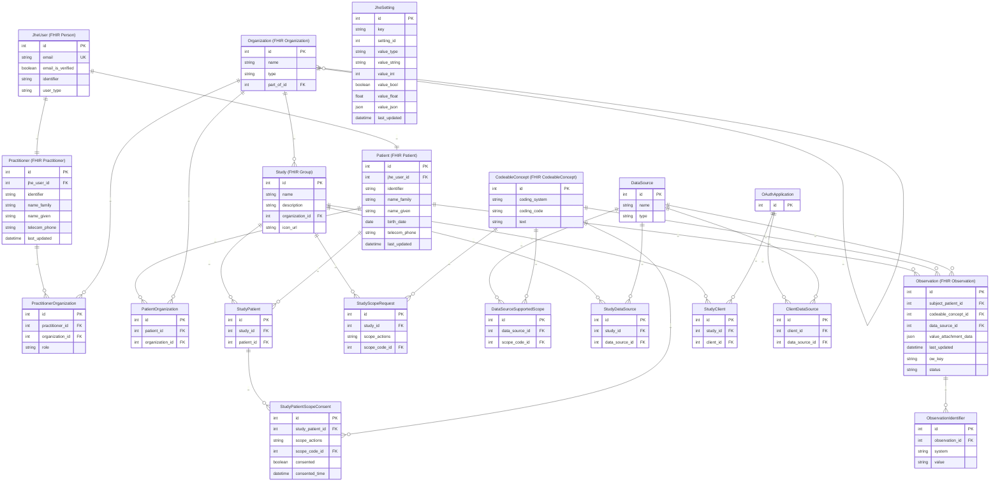

# JupyterHealth Exchange Data Model ERD

```mermaid
erDiagram
  "JheUser (FHIR Person)" {
    int id PK
    string email UK
    boolean email_is_verified
    string identifier
    string user_type
  }

  "Organization (FHIR Organization)" {
    int id PK
    string name
    string type
    int part_of_id FK
  }

  "Practitioner (FHIR Practitioner)" {
    int id PK
    int jhe_user_id FK
    string identifier
    string name_family
    string name_given
    string telecom_phone
    datetime last_updated
  }

  "Patient (FHIR Patient)" {
    int id PK
    int jhe_user_id FK
    string identifier
    string name_family
    string name_given
    date birth_date
    string telecom_phone
    datetime last_updated
  }

  PractitionerOrganization {
    int id PK
    int practitioner_id FK
    int organization_id FK
    string role
  }

  PatientOrganization {
    int id PK
    int patient_id FK
    int organization_id FK
  }

  "CodeableConcept (FHIR CodeableConcept)" {
    int id PK
    string coding_system
    string coding_code
    string text
  }

  "Study (FHIR Group)" {
    int id PK
    string name
    string description
    int organization_id FK
    string icon_url
  }

  StudyPatient {
    int id PK
    int study_id FK
    int patient_id FK
  }

  StudyPatientScopeConsent {
    int id PK
    int study_patient_id FK
    string scope_actions
    int scope_code_id FK
    boolean consented
    datetime consented_time
  }

  StudyScopeRequest {
    int id PK
    int study_id FK
    string scope_actions
    int scope_code_id FK
  }

  DataSource {
    int id PK
    string name
    string type
  }

  DataSourceSupportedScope {
    int id PK
    int data_source_id FK
    int scope_code_id FK
  }

  StudyDataSource {
    int id PK
    int study_id FK
    int data_source_id FK
  }

  "Observation (FHIR Observation)" {
    int id PK
    int subject_patient_id FK
    int codeable_concept_id FK
    int data_source_id FK
    json value_attachment_data
    datetime last_updated
    string ow_key
    string status
  }

  ObservationIdentifier {
    int id PK
    int observation_id FK
    string system
    string value
  }

  "Organization (FHIR Organization)" ||--o{ "Organization (FHIR Organization)" : _
  "JheUser (FHIR Person)" ||--|| "Practitioner (FHIR Practitioner)" : _
  "JheUser (FHIR Person)" ||--|| "Patient (FHIR Patient)" : _

  "Practitioner (FHIR Practitioner)" ||--o{ PractitionerOrganization : _
  "Organization (FHIR Organization)" ||--o{ PractitionerOrganization : _
  "Patient (FHIR Patient)" ||--o{ PatientOrganization : _
  "Organization (FHIR Organization)" ||--o{ PatientOrganization : _

  "Organization (FHIR Organization)" ||--o{ "Study (FHIR Group)" : _
  "Study (FHIR Group)" ||--o{ StudyPatient : _
  "Patient (FHIR Patient)" ||--o{ StudyPatient : _

  StudyPatient ||--o{ StudyPatientScopeConsent : _
  "CodeableConcept (FHIR CodeableConcept)" ||--o{ StudyPatientScopeConsent : _

  "Study (FHIR Group)" ||--o{ StudyScopeRequest : _
  "CodeableConcept (FHIR CodeableConcept)" ||--o{ StudyScopeRequest : _

  DataSource ||--o{ DataSourceSupportedScope : _
  "CodeableConcept (FHIR CodeableConcept)" ||--o{ DataSourceSupportedScope : _

  "Study (FHIR Group)" ||--o{ StudyDataSource : _
  DataSource ||--o{ StudyDataSource : _

  "Patient (FHIR Patient)" ||--o{ "Observation (FHIR Observation)" : _
  "CodeableConcept (FHIR CodeableConcept)" ||--o{ "Observation (FHIR Observation)" : _
  DataSource ||--o{ "Observation (FHIR Observation)" : _

  "Observation (FHIR Observation)" ||--o{ ObservationIdentifier : _

  JheSetting {
    int id PK
    string key
    int setting_id
    string value_type
    string value_string
    int value_int
    boolean value_bool
    float value_float
    json value_json
    datetime last_updated
  }

  StudyClient {
    int id PK
    int study_id FK
    int client_id FK
  }

  ClientDataSource {
    int id PK
    int client_id FK
    int data_source_id FK
  }

  OAuthApplication {
    int id PK
  }

  "Study (FHIR Group)" ||--o{ StudyClient : _
  OAuthApplication ||--o{ StudyClient : _

  OAuthApplication ||--o{ ClientDataSource : _
  DataSource ||--o{ ClientDataSource : _

```
